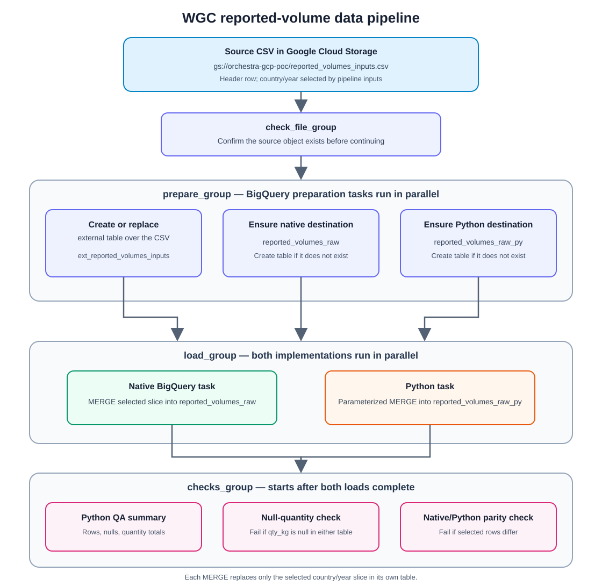

# WGC reported-volume pipeline

A proof of concept that uses [Orchestra](https://www.getorchestra.io/) to load
the WGC reported-volumes CSV from Cloud Storage into BigQuery. The load runs
twice: once as native BigQuery SQL and once as a Python task. The pipeline
then checks that both produce the same rows.

See the [pipeline handoff](./docs/WGC_REPORTED_VOLUME_PIPELINE.md) for the flow,
current status, and next steps.

## Repository layout

| Path | Purpose |
| --- | --- |
| [`orchestra/wgc-reported-volume-poc.yaml`](./orchestra/wgc-reported-volume-poc.yaml) | Orchestra pipeline definition |
| [`python/wgc_poc/qa_summary.py`](./python/wgc_poc/qa_summary.py) | Post-load summary for native and Python results |
| [`python/requirements.txt`](./python/requirements.txt) | Dependencies for the Python load and QA tasks |
| [WGC validator workflow](./.github/workflows/validate-pipeline.yml) | GitHub Actions job that validates WGC changes on PRs |
| [WGC run workflow](./.github/workflows/run-pipeline.yml) | Manually triggered GitHub Actions workflow |
| [Claude Code skills](./.claude/skills/) | WGC-focused project skills |

## What the pipeline does

The source file is `gs://orchestra-gcp-poc/reported_volumes_inputs.csv`. It
must have a header row and these columns, in order: `source`, `link`,
`mine_size`, `supply_chain`, `declaration`, `year`, `kg`, `notes`, `country`,
`weight`.

| Stage | Task group | What happens |
| --- | --- | --- |
| 1 | `check_file_group` | Confirms the CSV exists in GCS |
| 2 | `prepare_group` | Creates the external table `ext_reported_volumes_inputs` and makes sure both destination tables exist |
| 3 | `load_group` | Loads the selected country/year into both tables in parallel |
| 4 | `checks_group` | Reports counts for both tables; fails if either table has a null `qty_kg`, or if the two tables differ |

### Pipeline flow chart



*Figure: GCS source check → BigQuery preparation → parallel native/Python
loads → QA and parity checks.*

Both loaders read the external table and independently replace the selected
country/year slice in their own destination. The checks start only after both
load tasks complete.

All tables live in the `wgc_reported_volumes_poc` dataset:

- `reported_volumes_raw`: loaded by native BigQuery SQL
- `reported_volumes_raw_py`: loaded by the Python task

Each load is a `MERGE` scoped to one `source_country` and `source_year`. It
deletes that slice and reinserts it, so rerunning for the same inputs is safe.
`kg` and `weight` have their thousands separators removed and are cast to
`NUMERIC`. Each row records its `source_uri`, `loaded_at` and
`pipeline_run_id`.

### Inputs

| Input | Default | Meaning |
| --- | --- | --- |
| `country` | `Ghana` | Country to load (case-insensitive match against the CSV) |
| `year` | `2024` | Year to load |
| `notify_email` | pipeline owner | Address for failure, warning, success and slow-run emails |

### Orchestra connections

| Connection ID | Type | Used by |
| --- | --- | --- |
| `orchestra_gcp_59732` | GCP Cloud Storage | File check |
| `orchestra_gcp_52611` | GCP BigQuery | DDL, native load and checks |
| `python_wgc_70839` | Python | Python load |

The BigQuery service account needs to read the CSV from Cloud Storage and to
create and query tables in the dataset. The Python connection needs Orchestra
SDK access so it can read the linked BigQuery connection's credentials.

## Working with the pipeline

Install and log in to the Orchestra CLI:

```sh
pip install orchestra-cli
orchestra login
```

### First-time setup: validate, push, then import once

Import registers the Git-backed pipeline in Orchestra. It does **not** run the
pipeline. Do this setup only once:

1. Confirm that the GCS, BigQuery, and Python connections listed above exist
   in Orchestra and have the required permissions.
2. From the repository root, validate the local YAML:

```sh
orchestra pipeline validate ./orchestra/wgc-reported-volume-poc.yaml
```

3. Push the validated pipeline YAML to the GitHub repository/branch connected
   to Orchestra. Review `git status` and stage only the intended files before
   committing.
4. Import the pipeline once from the repository root:

```sh
orchestra pipeline import \
  --alias wgc_reported_volume \
  --path ./orchestra/wgc-reported-volume-poc.yaml
```

The import registers the Git-backed pipeline and returns its ID. This is the
one-time registration step, not a run. Save the returned pipeline UUID. Do
not import again for future YAML changes, because every import can create a
duplicate.

> **Existing pipeline:** its YAML path remains
> `orchestra/wgc-reported-volume-poc.yaml`, so the existing Git-backed
> pipeline can continue using the same path. Do not import it again.

### Before running an updated pipeline

Because the pipeline is Git-backed, Orchestra uses the YAML from its connected
GitHub branch. After changing the pipeline or its Python code, review and push
the intended changes before starting a run:

```sh
git status --short
git add README.md orchestra/ python/ docs/ .github/ .claude/
git diff --cached
git commit -m "Update WGC reported-volume pipeline"
git push origin main
```

Only stage files you intend to publish. If `main` is protected, push a branch
and merge it through a pull request. Do not run `orchestra pipeline import`
again for updates.

### Option A: Run from Orchestra

1. Open **Pipelines** in Orchestra and select **WGC reported volume PoC**.
2. Select **Run** (or **Trigger**) and set `country` and `year` (defaults:
   `Ghana` and `2024`).
3. Start the run and watch the task graph. The native and Python load tasks
   run in parallel; QA and data-quality checks follow.
4. If a task fails, open its run logs in Orchestra. On success, the output
   tables are `reported_volumes_raw` and `reported_volumes_raw_py` in the
   `wgc_reported_volumes_poc` dataset.

To start a run from the CLI instead:

```sh
orchestra pipeline run --alias wgc_reported_volume
```

The CLI waits for completion by default. This command uses the YAML defaults;
use Orchestra's UI to enter non-default country/year inputs.

### Option B: Run from GitHub Actions

The manual workflow
[`.github/workflows/run-pipeline.yml`](./.github/workflows/run-pipeline.yml)
starts the same Orchestra pipeline and waits for its result. Before using it,
open **GitHub → repository Settings → Secrets and variables → Actions** and add:

- Repository secret `ORCHESTRA_API_KEY`: an Orchestra API key.
- Repository variable `ORCHESTRA_PIPELINE_ID`: the UUID printed when the
  pipeline was imported (not the alias).

Then open **Actions → Run WGC reported-volume pipeline → Run workflow**,
choose the branch containing the pipeline YAML, enter the country and year,
and start it. The workflow is manual-only; pushes do not trigger data loads.

## Claude Code skills

This repository includes WGC project skills in
[`.claude/skills/`](./.claude/skills/).
Claude Code picks them up automatically when you open the repo, and you can
also call them by name:

| Skill | Use it to |
| --- | --- |
| `/validate-pipeline` | Validate the YAML and compile the Python code before a commit or PR |
| `/run-pipeline` | Run the pipeline for a country and year, then summarise the result and any failing task's logs |
| `/change-load-logic` | Change the load or table schema while keeping the native and Python paths identical |
